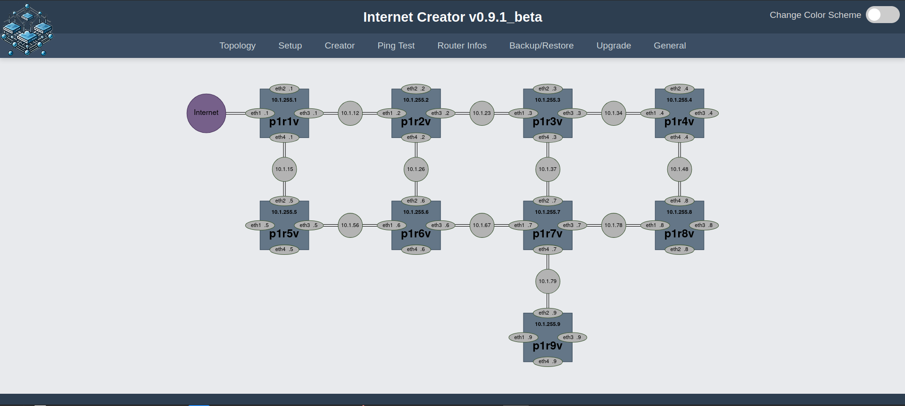
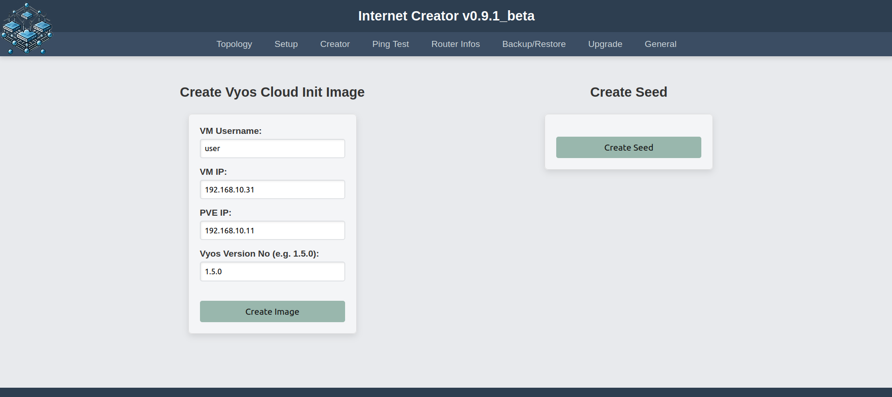
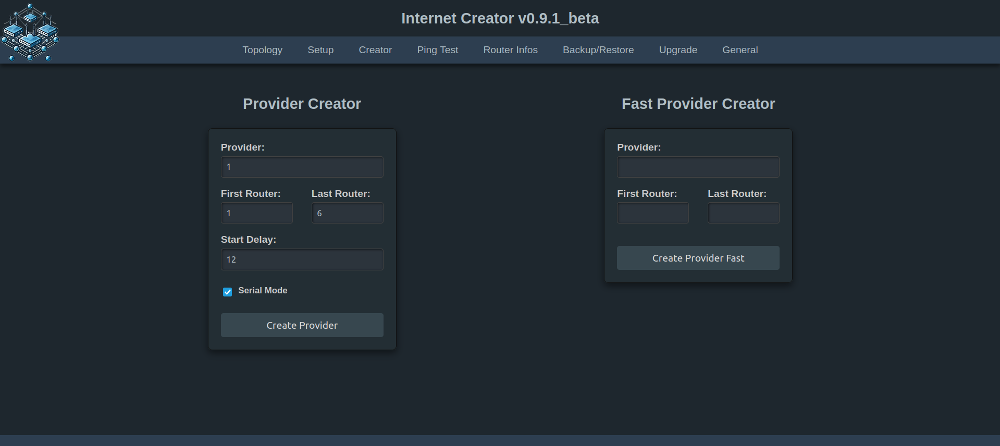
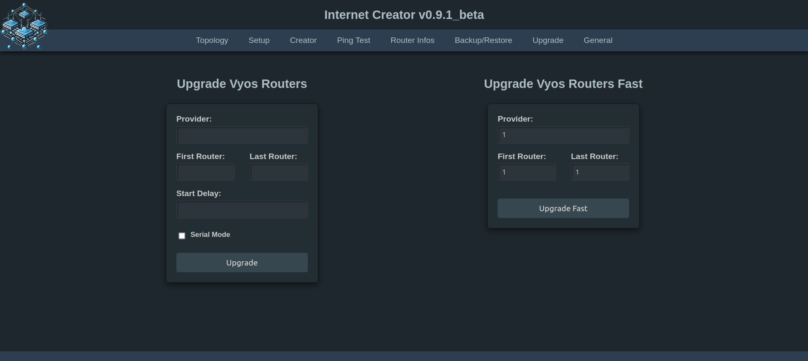

## Verwendungszwecke:

Es geht hier darum, drei Netzwerke (ISP's) bestehend aus jeweils 9 Vyos-Routern automatisiert unter PVE aufzusetzen und mit Ansible zu konfigurieren. Der Internet Creator steuert eine abgewandelte Version von [aibix0001 (Gerd's) provider.sh](https://github.com/aibix0001/aasil), die darauf ausgelegt ist, sich bzgl. der Arbeitsgeschwindigkeit an die Gegebenheiten verschieden starker CPU's anzupassen: So gibt es einen Fast Modus für Rechner mit besonders starken CPU's, einen Normalmodus für schwächere CPU's und einen seriellen Modus für besonders schwache CPU's. Um den passenden Modus für die jeweils verwendete CPU zu finden, siehe den Abschnitt 'Erfahrungswerte' im 'Beschreibung und Gebrauchshinweise zum INC v0.9.1_beta.pdf'. Das [Aibix-Projekt](https://www.twitch.tv/aibix0001) wendet sich u.a. an Auszubildende und Studenten im IT-Bereich, sowie weitere Interessierte, die nicht unbedingt immer drei Kraftpakete zur Verfügung haben. Der Internet Creator ist deshalb insbesondere auch zur Verwendung mit schwächeren Rechnern entwickelt worden.

## Neueinsteiger

Für alle, die mit den [Streams](https://github.com/aibix0001/streams) von Aibix nicht von Anfang an vertraut sind, gibt es anstatt des Quickstarts das Setup.pdf, in dem der Aufbau des speziellen PVE-Setup's im Einzelnen beschrieben wird, innerhalb dessen der 'streams'-Ordner mit dem Internet Creator läuft.

## Besondere Voraussetzungen

sudo apt install jq

python3 -m venv .venv

source .venv/bin/activate

pip3 install -U setuptools wheel scp ansible paramiko flask flask-socketio gunicorn eventlet

## Quickstart

Nach dem Clonen dieses Repos den Ordner streams aus dem Ordner internet_creator_v0.9.1_beta herausnehmen und in den Pfad /home/user/ des PVE-Hosts ablegen und dann von da aus arbeiten.

Die automatische Erstellung des Vyos Cloud Init Images findet auf dem DHCP-Server statt. Das funktioniert nur, wenn der Server in der Weise aufgesetzt worden ist, die im Setup.pdf beschrieben wird. Konkret bedeutet das, dass die SSH-Schlüssel zwischen dem PVE-User und dem DHCP-Server-User ausgetauscht werden und das Skript dhcp_configure.sh ausgeführt wird. Für alle, deren PVE-User nicht user heißt: Unbedingt das Skript useradd.sh (als root) laufen lassen. Das spart nicht nur eine Menge Arbeit (vgl. Beschreibung und Gebrauchshinweise zum INC v0.9.1_beta.pdf Anmerkung (4)), sondern ist auch Voraussetzung dafür, dass das Skript dhcp_configure.sh funktioniert.

Der Internet Creator wird folgendermaßen aufgerufen:

source .venv/bin/activate

cd streams

./inc.sh

Oder ./go.sh unter /home/user/ ausführen - noch einfacher mit alias go='./go.sh' in der .bashrc

Nötigenfalls sudo-Password des Users im Terminal eingeben.

Nicht zusammen mit Dark Reader verwenden!

## Neue Features des INC v0.9.1_beta

Das Vyos Cloud Init Image und die seed.iso können auf komfortable Weise erstellt werden: Bei der Erstellung der seed.iso ist keinerlei Eingabe notwendig, sondern man drückt einfach auf den Knopf. Und bei der Erstellung des Cloud Init Images wird automatisch zunächst die neueste Vyos Version heruntergeladen. Damit gibt es eine Bewegung in Richtung teilautomatisiertes Setup. Wer Backups der pfSense(n) und des/der DHCP-Server(s) hat, kann diese restoren und auf diese Weise die Automatisierung des Setups erheblich erhöhen. Für das restliche Setup sind weitere Vorgänge geskriptet worden, die bislang noch händisch ausgeführt werden mussten.

Durch Integration von Gerds neuen [Update- und Cleanup-Skripten](https://github.com/aibix0001/streams/tree/master/ops/ansible/vyos_system-management) konnten die Upgradeprozesse erheblich verbessert werden:
Das Upgrade bestehender Router kann wahlweise im seriellen, normalen oder im Fast Mode ausgeführt werden.
Vor jedem Upgrade wird, falls nötig, die neueste Vyos Version heruntergeladen und alte Images automatisch gelöscht und zwar sowohl auf den Routern, als auch im Verzeichnis /home/user/streams/ansible/vyos-images auf dem PVE. Der Anwender muss somit jetzt nicht mehr entscheiden, ob die Vyos Upgrade Version aufgefrischt werden soll, und die entsprechende Checkbox ist verschwunden.

## Spezielle Probleme der Version v0.9.1_beta

Statt auf einem Development-Server läuft die Web App auf einem professionellen Gunicorn Server. Obwohl das Frontend weitestgehend unauffällig läuft, gibt es im Backend regelmäßig Fehlermeldungen, die bislang nicht abgestellt werden konnten. Diese Fehlermeldungen treten aber nur im Zusammenhang mit der Verwendung des flask-socketio beim Ping-Test und der Anzeige von Routerinformationen auf und sind offenbar darauf zurückzuführen, dass sich der Gunicorn-Server bzw. das Eventlet-Modul mit dem socketio nicht ganz verträgt. Zu Einzelheiten siehe 'Spezielle Probleme des INC on Gunicorn.pdf'.

Achtung: Sobald man 'pip install gunicorn eventlet' in der .venv ausgeführt hat, wird der Ping Test und die Ausgabe der Router Infos unter Version v0.9 in dieser .venv nicht mehr funktionieren. Man braucht dann vorher:

pip uninstall gunicorn eventlet

## Troubleshooting

Insbesondere bei schwächeren/langsameren Rechnern kann es in seltenen Fällen Timeoutprobleme geben. Dazu bitte die Datei Timeoutprobleme.pdf lesen. Vermutlich sind Timeoutprobleme in den allermeisten Fällen auf die Verwendung von Swap zurückzuführen!

Sollte mal der (seltene) Fall eintreten, dass obwohl alles korrekt aussieht - die Configs der Router sind ok, es gibt ein DHCP-Lease von der pfSense und die VLAN-Tags des LAN Netzes stimmen auch (also 1011, 2011 bzw. 3011) - es aber trotzdem nicht möglich ist, raus zu pingen, dann alle Router restarten. Wenn es dann immer noch nicht geht, mit anderem (meistens höherem) Delay-Wert oder ggf. im Fast Modus nochmal neu erzeugen.
